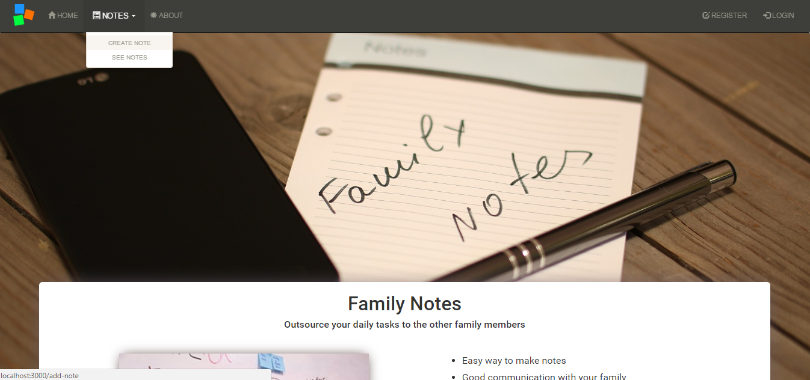
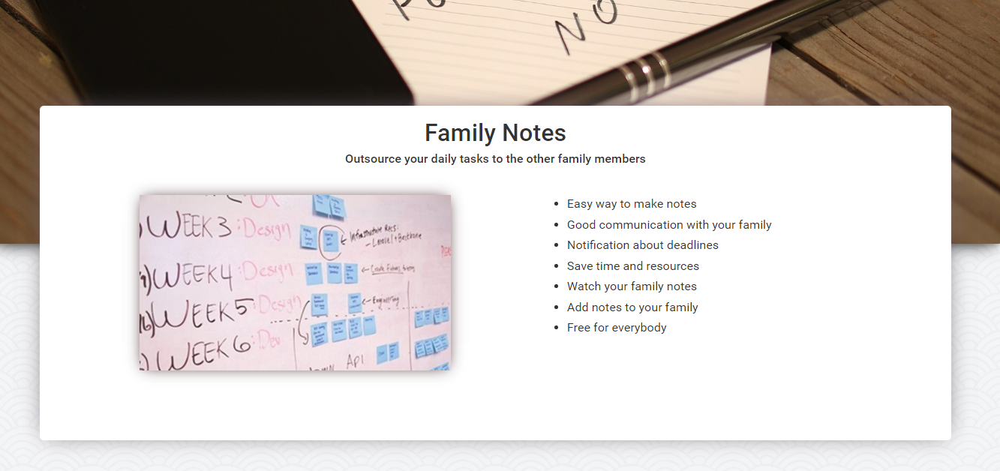
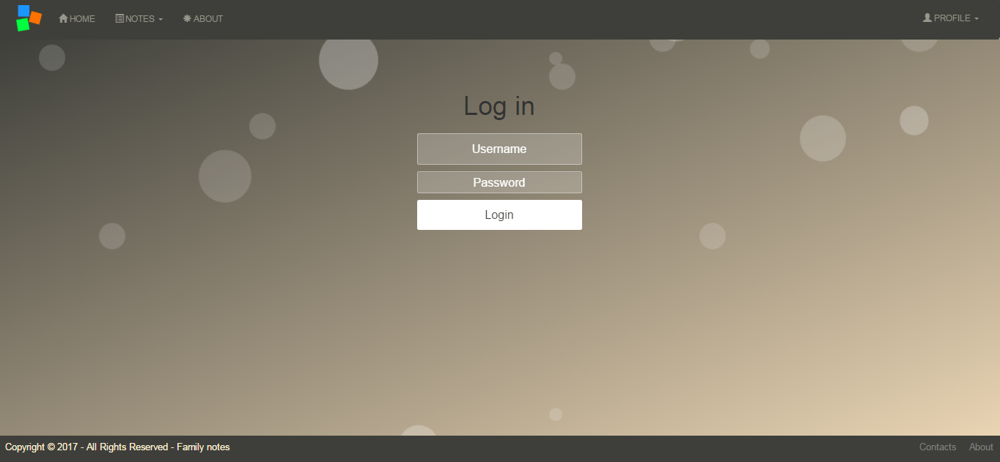
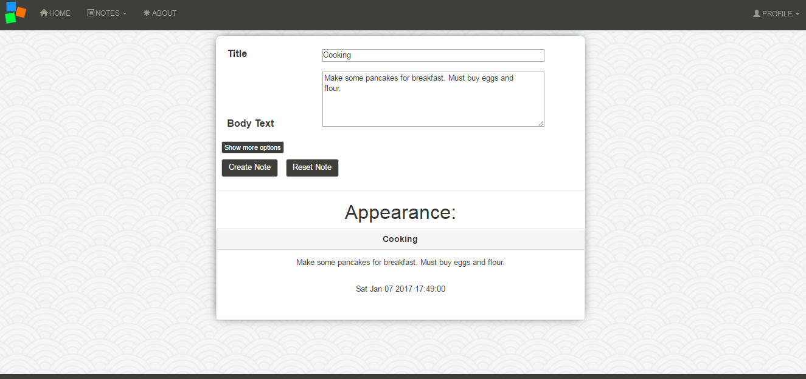
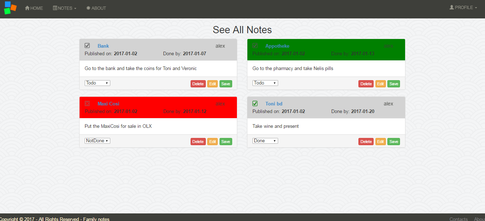
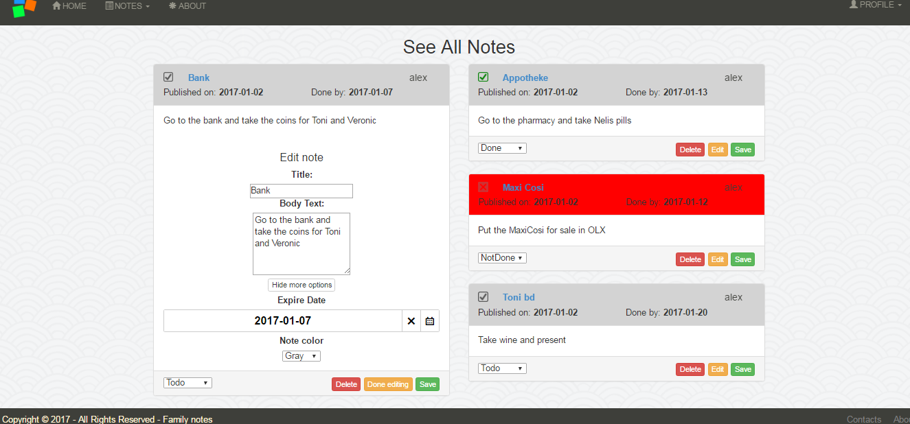

# familyNotes

# [KillerApp](https://team-heat-killer-app.herokuapp.com/)

# Site main idea

## Easy way to make notes
- you can add notes easily 
- you can edit your notes
- you can put deadlines to your notes
- you can choose state to every note (done, not done, todo)
- you can delete notes
- you can choose notes color

## Save time and resources
- you don't need to be at home to see your notes, check them from your phone
- it's free 

# Routes

## Home
- /home -> home page

## Notes (only for login users)
- /add-note -> you can make your own note from here 
- /notes -> you can see all notes, you can edit them and delete them

## About
- /about -> you can see information for all team members

## User
- /register -> free and easy register
- /login -> login after the register
- /logout -> login people can logout
- /profile -> view your profile

